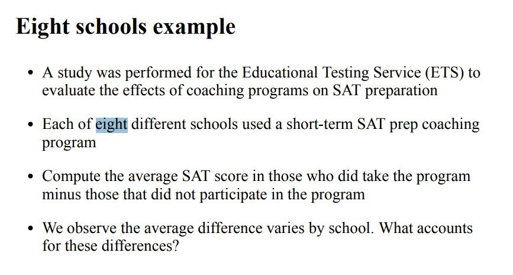
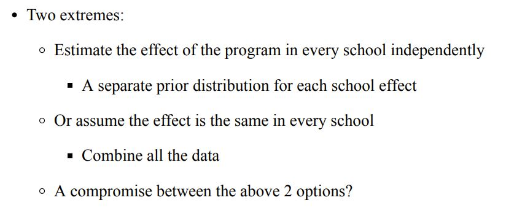
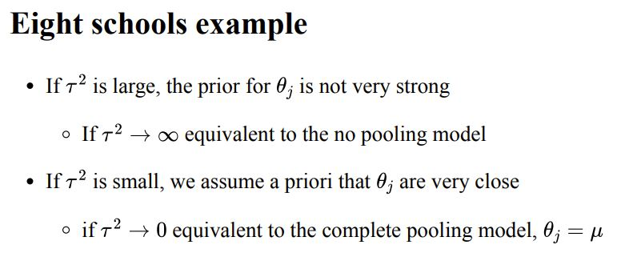

# This lab will focus on the following topics:

* Applying the Metropolis algorithm to a linear model (Wheels Example)

* Hierarchical Modeling (Eight Schools Example)

```{r, warning=FALSE, message=FALSE}
library(coda)
library(MASS)
library(tidyverse)
library(ggplot2)
library(knitr)
knitr::opts_chunk$set(echo=TRUE, 
                      cache=FALSE,
                      message = FALSE,
                      warning = FALSE,
                      fig.width=5, 
                      fig.height=5,
                      fig.align='center',
                      fig.pos = 'H')
library(rstan)
library(Rcpp)
library(jpeg)
```

# Metropolis Algorithm

To generate sample s + 1 of a Metropolis MCMC sampler given (possibly) unnormalized density $p(\theta)$: 

1. Propose a new sample $\theta_*$ given the old sample $\theta_s$ from a symmetric distribution
2. If $p(\theta_*) > p(\theta_s)$, then set $\theta_{s + 1}$ equal to $\theta_*$ and go to the next iteration
3. If $p(\theta_*) < p(\theta_s)$, then
    a. Generate a random number r from uniform(0, 1)
    b. If $r < \frac{p(\theta_*)}{p(\theta_s)}$, set $\theta_{s + 1}$ equal to $\theta_*$ and go to the next iteration
    c. Otherwise set $\theta_{s + 1}$ equal to $\theta_s$

# Little wheels

Assume you are given the following code and told to use it to sample from a normal distribution
```{r}
# pdf we want to sample
p = function(theta) {
  dnorm(theta, 1.0, 2.0)
}

metropolis = function(theta_s) {
  # Function should return the next state
  #   in the Markov chain given the current state, theta_s!
  
  theta_p = rnorm(1, theta_s, 1.0)
  
  if(p(theta_p) > p(theta_s)) {
    return(theta_p)
  } else {
    r = runif(1)
    if(r < p(theta_p) / p(theta_s)) {
      return(theta_p)
    } else {
      return(theta_s)
    }
  }
}

N = 10000
samples = rep(0, N)
samples[1] = 10.0
for(i in 1:(length(samples) - 1)) {
  samples[i + 1] = metropolis(samples[i])
}
```


We can look at our traceplots, effective sample size estimates, and acf plots with the coda package:
```{r}
plot(samples, type="l")
effectiveSize(samples)
acf(samples)
```

# Medium wheels
Using the un-logged densities is numerically unstable. As an example of what can happen, compare the outputs of:
```{r}
print(1.0e-100 * 1e-100, format = "e", digits = 20)
print(1.0e-200 * 1e-200, format = "e", digits = 20)
```

It is really common to need to evaluate numbers this small in a probabilistic model. For instance, a term like $0.36^{300}$ might come up when evaluating a binomial pmf that models a basketball player's yearly shooting percentage. If we extend that to maybe three years worth of shots-made, ($0.36^{900}$), we'll see that evaluates to zero. The trick to avoid this is working on the log scale.

We want our metropolis algorithm to work on a log scale too. Because log is a monotonic increasing function, we can just take the log of the conditions in steps 2 and 3 above and get our new algorithm:

2. If $\log p(\theta_*) > \log p(\theta_s)$, then set $\theta_{s + 1}$ equal to $\theta_*$ and go to the next iteration
3. If $\log p(\theta_*) < \log p(\theta_s)$, then
    a. Generate a random number r from uniform(0, 1)
    b. If $\log(r) < \log p(\theta_*) - \log p(\theta_s)$, set $\theta_{s + 1}$ equal to $\theta_*$ and go to the next iteration
    c. Otherwise set $\theta_{s + 1}$ equal to $\theta_s$


# Hierarchical Modeling (Eight Schools Example)

```{r, echo=FALSE, out.width = '80%'}

```

```{r, echo=FALSE, out.width = '80%'}

```

**Model Specification:**

$$\theta_j \sim N(\mu, \tau^2)$$
$$y_j \sim N(\theta_j, \sigma_j^2)$$

- $\theta_j$ are the true unknown effects of the program in school j

- $y_j$ is the observed effects of the program in school j

- Add a shared normal prior distribution to $\theta_j$

- Assume the global mean, $\mu$ is also unknown

- $\tau^2$ determines how much weight weight we put on the independent estimate vs the pooled estimate

```{r, echo=FALSE, out.width = '80%'}

```

```{r}
## data ##
schools_dat <- list(J = 8, 
                    y = c(28,  8, -3,  7, -1,  1, 18, 12),
                    sigma = c(15, 10, 16, 11,  9, 11, 10, 18))
```


Estimate hyperparameter $\mu$ and $\tau$
 ```{r, eval=FALSE}
data {
   int<lower=0> J;          // # of schools
   real y[J];               // estimated treatment
   real<lower=0> sigma[J];  // std err of effect
}

parameters {
  real theta[J];        // school effect
  real mu;              // mean for schools
  real<lower=0> tau;    // variance between schools
}

model {
  theta ~ normal(mu, tau);
  y ~ normal(theta, sigma);
}
```
Further, introduce $\eta$, the unscaled deviation from $\mu$ by school and let:
$$\theta_j = \mu + \tau * \eta_j,$$
where $\eta_j \sim N(0, 1)$

Noting that $$\theta_j \mid \mu, \tau \sim N(\mu, \tau^2)$$

 ```{r, eval = FALSE}
//saved as 8schools.stan
data {
  int<lower=0> J;         // number of schools 
  real y[J];              // estimated treatment effects
  real<lower=0> sigma[J]; // standard error of effect estimates 
}
parameters {
  real mu;                // population treatment effect
  real<lower=0> tau;      // standard deviation in treatment effects
  vector[J] eta;          // unscaled deviation from mu by school
}
transformed parameters {
  vector[J] theta = mu + tau * eta;        // school treatment effects
}
model {
  target += normal_lpdf(eta | 0, 1);       // prior log-density
  target += normal_lpdf(y | theta, sigma); // log-likelihood
}
```

```{r, cache = TRUE}
library(cmdstanr)
install_cmdstan()
stan_model <- cmdstan_model("eight_schools.stan")
stan_fit <- stan_model$sample(
    data = schools_dat,
    refresh = 0, show_messages=FALSE)
samples <- stan_fit$draws(format = "df")
```

```{r}
shrinkage_plot <- function(empirical, posterior_mean,
                           shrink_point=mean(posterior_mean)) {
  
  tibble(y=empirical, pm=posterior_mean) %>% 
    ggplot() + 
    geom_segment(aes(x=y, xend=pm, y=1, yend=0), linetype="dashed") + 
    geom_point(aes(x=y, y=1)) + 
    geom_point(aes(x=pm, y=0)) + 
    theme_bw(base_size=14) + 
    geom_vline(xintercept=shrink_point, color="blue", size=1.2) + 
    ylab("") + xlab("Estimate") + 
    scale_y_continuous(breaks=c(0, 1), 
                       labels=c("Posterior Mean", "MLE"), 
                       limits=c(0,1))
}
```


```{r}
theta_post <- colMeans(samples[c(12:19)])
print(theta_post)
# shrinkage plot #
shrinkage_plot(schools_dat$y, theta_post)
```

The overall average school effect, $\mu$, is also random.  Here is a histogram of the posterior distribution:

```{r}
# histogram for mu #
mu_post = tibble(mu = samples$mu)
ggplot(mu_post, aes(mu)) + 
  geom_histogram() + 
  theme_bw(base_size = 16) + 
  labs(x = expression(mu))
```
